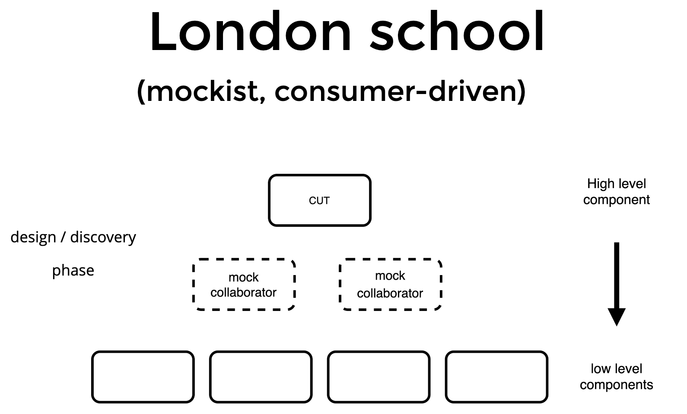

# Point of sale - kata definition

> TDD is important. TDD works. TDD is a professional discipline that all programmers should learn and practice. But it is not TDD that causes good or bad designs. You do that.
> 
> Uncle Bob

## Description

Code kata to practice outside in tdd inspired by [super market kata](http://codekata.com/kata/kata09-back-to-the-checkout/) but
slightly different.

The idea is to code a **Point of Sale**, by which we could calculate and checkout an ongoing sale in a supermarket.

## Catalog
```
Product-id   Price   Description
--------------------------------
901234       1.50     Chips
507780       2.35     Red Bull
```

## ACs

- When a product is scanned, the price is displayed.
- When a scanned product is not present, a message 'invalid product' is displayed.
- Each time a product is scanned successfully, it will be added to the current digital shopping cart, keeping track of all the items for this sale.
- If a product was added by mistake, we can remove it from the current cart by product-id, the price will be displayed in negative.
- In any moment, we can cancel the current sale, clearing out the cart.
- When the sale is finished, the point of sale will check out, calculating the total price and displaying it. 

## Rules

<p align="center">
  
</p>

1. RED: Create a unit tests that fails. 
   1. Red means that the test fails, the assertion fails
   2. Write the code in the test from consumer perspective, even the classes or functions are not there yet
      1. You may have to write the minimal code to make the compiler happy
2. GREEN: Write code that makes that test pass.
   1. Make the code compile
   2. Pass the tests with functional code
   3. If the new piece of code can’t be implemented, here you have a collaborator/dependency, **come back to the test and mock it**.
3. REFACTOR: Clean up the mess you just made.
   1. Write code that you are proud of
   2. Refactor old and new code
   3. You can also detect collaborators in this phase

## Hints

- Write consumer driven test case scenarios
- Don't leak implementation details in the test case name
- Write the assertion first
- Organize your code in Given/When/Then or Arrange/Act/Assert

## Outside-in TDD

<p align="center">
  
</p>


## Resources

- http://coding-is-like-cooking.info/2013/04/outside-in-development-with-double-loop-tdd/
- https://blog.cleancoder.com/uncle-bob/2014/12/17/TheCyclesOfTDD.html
- https://martinfowler.com/bliki/TestDrivenDevelopment.html

